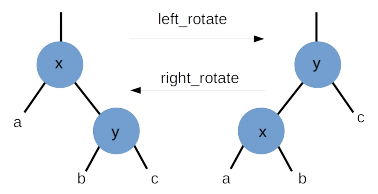
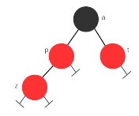
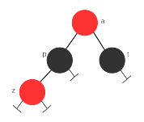

# Árvore Rubro-Negra
*Retirado do roteiro de aula do Prof. Carlos da Silva dos Santos, CMCC/UFABC.*

1. Estude o código dos arquivos `rb_tree.h` e `rb_tree.c`.

2. Implemente a função `left_rotate` que realiza uma rotação
   para esquerda na árvore, de acordo com a declaração:

   ```c
   void left_rotate (Node ** T, Node * x)
   ```

   Use a Figura 1 como referência para implementação da função.
   A função supõe que o nó de entrada `x` tenha um filho
   direito `y`. Ao final do proceso, `x` torna-se o filho
   esquerdo de `y` e a sub-árvore esquerda de `y` torna-se
   a sub-árvore direita de `x`. Lembre-se que o ponteiro
   direito (ou esquerdo) do pai de `x` precisa ser acertado
   para apontar para `y`.

<figure align="center">
  
  <figcaption>
    Figura 1: Ilustração das operações de rotação.
  </figcaption>
</figure>

3. Implemente a função `right_rotate` que realiza uma rotação
   para direita na árvore, de acordo com a declaração:

   ```c
   void right_rotate (Node ** T, Node * x)
   ```

   A função `right_rotate` é análoga à função `left_rotate`
   do item anterior, trocando-se esquerda por direita
   e vice-versa.

4. Implemente a função `flip_color` que realiza uma coloração
   de nós, de acordo com a declaração:

   ```c
   void flip_color (Node ** T, Node * z)
   ```

   A troca de cores deve ser realizada se as seguintes condições
   forem verificadas:

   - O nó de entrada `z` é vermelho.
   - O pai (`p`) e o tio (`t`) também são vermelhos.
   - O avô (`a`) de `z` é preto.

   Ao final do processo, teremos:

   - O nó de entrada `z` continua vermelho.
   - O pai (`p`) e o tio (`t`) mudam para preto.
   - O avô (`a`) de `z` torna-se vermelho.

   As Figuras 2 e 3 mostram, respectivamente, uma configuração
   em que devemos aplicar a mudança de cor e o resultado
   final depois do processo.

<figure align="center">
  
  <figcaption>
    Figura 2: Configuração antes da coloração.
  </figcaption>
</figure>

<figure align="center">
  
  <figcaption>
    Figura 3: Configuração depois da coloração.
  </figcaption>
</figure>